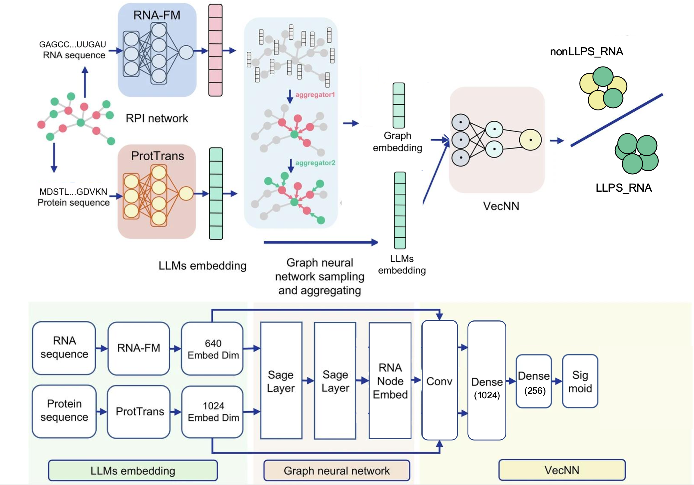

# LLPS_Graphsage_VecNN

## Overview

​	This study developed a multi-feature fusion RNA language model for LLPS prediction by integrating a graph neural network embedding layer with the unsupervised BERT language model. Since RNA's intrinsic properties and RNA–protein interactions (RPIs) critically influence LLPS by mediating multivalent scaffolding, constructing deep learning models that incorporate both dimensions is vital for uncovering the molecular mechanisms of RNA phase behavior.

​	The benchmark dataset constructed for our model consists of 11,854 RNAs, 237 proteins, and 226,683 RPI interactions. To obtain feature information from RNA and protein sequences, [RNA-FM](https://github.com/ml4bio/RNA-FM) and [ProtTrans](https://github.com/agemagician/ProtTrans) were used to generate embedding features for RNA and protein sequences. These models generate 640-dimensional embeddings for RNAs and 1024-dimensional embeddings for proteins.

​	To capture the intricate interactions between RNAs and proteins, an inductive node representation learning graph neural network (GNN)   [[Inductive Representation Learning on Large Graphs]](https://arxiv.org/abs/1706.02216) is deployed, offering an efficient approach to generating node representations from the available RPI network. This GNN module consists of two SAGE layers designed to rapidly learn a localized embedding function through neighbor sampling and aggregation. Specifically, neighbors are randomly sampled from a target node’s first-order neighborhood, followed by recursive sampling from subsequent neighborhoods in the consecutive layer. Following each sampling layer, a learnable aggregation function consolidates the feature vectors of neighboring nodes, explicitly considering both neighbor features and their relative relationships to ensure strong generalization capabilities. Ultimately, this pipeline yields a fixed-dimensional embedding representation for each node within the RNA–protein interaction graph.

​	for each node *v* with LLMs embedding in the RPI network, two SAGE layers compute:


$$
\bar{x}_{\mathscr{N}(v)}^{(k)}=\mathrm{AGGREGATE}_k\big(\{ \bar{x}_{u}^{(k-1)} \mid u \in \mathscr{N}(v) \}\big)
$$

$$
{\bar{x}}_{v}^{\left(k\right)}=\sigma \left({W}^{(k)}\cdot {\rm{CONCAT}}\left({\bar{x}}_{v}^{\left(k-1\right)},{\bar{x}}_{{\mathscr{N}}\left(v\right)}^{\left(k\right)}\right)\right)
$$

$$
{\bar{x}}_{v}^{(k)}=\frac{{\bar{x}}_{v}^{(k)}}{\left|\left|{\bar{x}}_{v}^{(k)}\right|\right|}
$$

where *k* = 1, 2. *N(v)* denotes the neighborhood of node v,||∙|| represents the Euclidean norm. 

​	Next, We concatenate the embedding features from the RNA-FM LLM with those from the Graph Neural Network (GNN), and then feed the combined vector into the VecNN architecture. The detailed calculations are formulated as follows:


$$
{\widetilde{x}}_{0}={\rm{CONCAT}}\left({\bar{x}}_{0},{z}_{0}\right)
$$

$$
{\widetilde{x}}_{0}^{{\prime} }={\rm{Conv}}\left({\widetilde{x}}_{0}\right)
$$

$$
{\widetilde{x}}_{0}^{{\prime} {\prime} }={\rm{ReLU}}\left({{W}^{(0)}{\widetilde{x}}_{0}^{\prime}}\right)
$$

$$
{h}^{(0)}={\rm{ReLU}}\left({W}^{(1)}{\widetilde{x}}_{0}^{\prime}\right)
$$

$$
{h}^{(1)}={\rm{ReLU}}\left({W}^{(2)}{h}^{(0)}\right)
$$

$$
\hat{y}={\rm{sigmoid}}\left({W}^{(3)}{h}^{(1)}\right)\in \left[0,1\right]
$$

​	We chose a 1D convolutional layer as the feature extraction layer, and the RNA embeddings are individually input into the 1D convolutional layer with a kernel size of 3 to extract their features. These features then go through a dense layer that outputs a 1024-dimensional vector to standardize the dimensions. Next, the RNA embeddings are sent through two fully connected dense layers, resulting in the final binding probability output.



## Datasets

Provide normalized 640-dimensional embeddings for 1,1854 RNA samples, normalized 1024-dimensional embeddings for 237 protein samples, and 226,683 RPI (RNA-Protein Interaction) pairs for training and testing.

## Graph Neural Network Pre-training

Graph Neural Network (GNN) pre-training script:

```shell
Pre_training_Graph_neural_network/run_Pretrain_Graphsage.sh
```

## VecNN training

VecNN model pre-training script:

```shell
Graphsage_MLP/run_modules.sh
```

## Reference

```
1. Liu H., Jian Y., Zeng C., et al. (2025).
   RNA-protein Interaction Prediction Using Network-guided Deep Learning.
   Communications Biology, 8, 247.
   DOI: 10.1038/s42003-025-07694-9
2. Hamilton W. L., Ying R., Leskovec J. (2017).
   Inductive Representation Learning on Large Graphs.
   Proceedings of the 31st International Conference on Neural Information Processing Systems (NeurIPS 2017).
   DOI: 10.48550/arXiv.1706.02216
```

